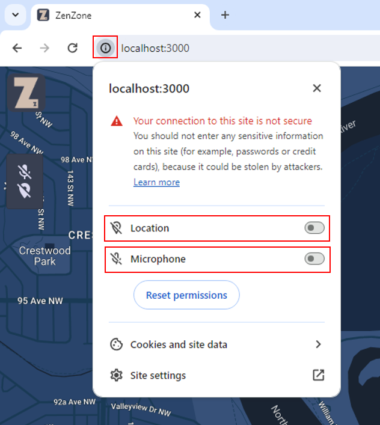
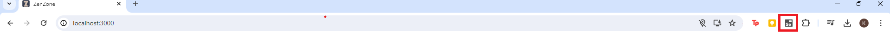
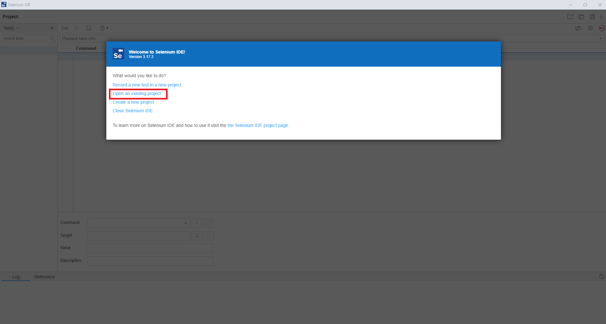

Selenium Testing Instructions
===================================
Before starting to run the tests, please do not allow ZenZone to have access to your location. This is because the map will automatically center on your location.\


1. Run ZenZone on your local machine using ```npm run start```
2. Download the Selenium IDE extension for Chrome or Edge:\
Add extension here: https://chromewebstore.google.com/detail/selenium-ide/mooikfkahbdckldjjndioackbalphokd
3. Open the the extension\

4. Now you should see a welcome screen. Click "Open an existing project" and navigate to where you have the ZenZone.side file saved.\

5. Along the left, you should see the recorded Selenium tests. \
- At the top left, there is a "play" button with 3 lines. Click this to run all tests.\
- To run individual tests, click on the test then click on the "play" button.\

